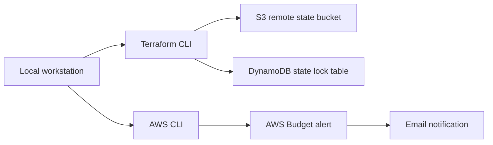

# AWS Job Scraper

Foundation for deploying the AWS job scraper infrastructure with Terraform.

## Phase 0

- AWS CLI: installed and authenticated.
- Terraform: installed.
- Remote state: S3 bucket with versioning/encryption and DynamoDB lock table.
- Terraform skeleton: `terraform/` with a `dev` environment backend config.
- Budget: $75 monthly budget with an 80% email notification.

## Architecture



## Verified Locally

```sh
aws --version
terraform version
aws sts get-caller-identity
terraform plan
```

Current AWS account: `548911563197`
Current default region: `us-east-1`

## Manual State Bootstrap

State resources are created outside Terraform to avoid the backend chicken-and-egg problem.

```sh
aws s3api create-bucket \
  --bucket aws-job-scraper-tfstate-548911563197-us-east-1 \
  --region us-east-1

aws s3api put-bucket-versioning \
  --bucket aws-job-scraper-tfstate-548911563197-us-east-1 \
  --versioning-configuration Status=Enabled

aws s3api put-bucket-encryption \
  --bucket aws-job-scraper-tfstate-548911563197-us-east-1 \
  --server-side-encryption-configuration '{"Rules":[{"ApplyServerSideEncryptionByDefault":{"SSEAlgorithm":"AES256"}}]}'

aws dynamodb create-table \
  --table-name aws-job-scraper-terraform-locks \
  --attribute-definitions AttributeName=LockID,AttributeType=S \
  --key-schema AttributeName=LockID,KeyType=HASH \
  --billing-mode PAY_PER_REQUEST \
  --region us-east-1
```

## Terraform

```sh
cd terraform
terraform init -backend-config=environments/dev/backend.hcl
terraform validate
terraform plan
```
